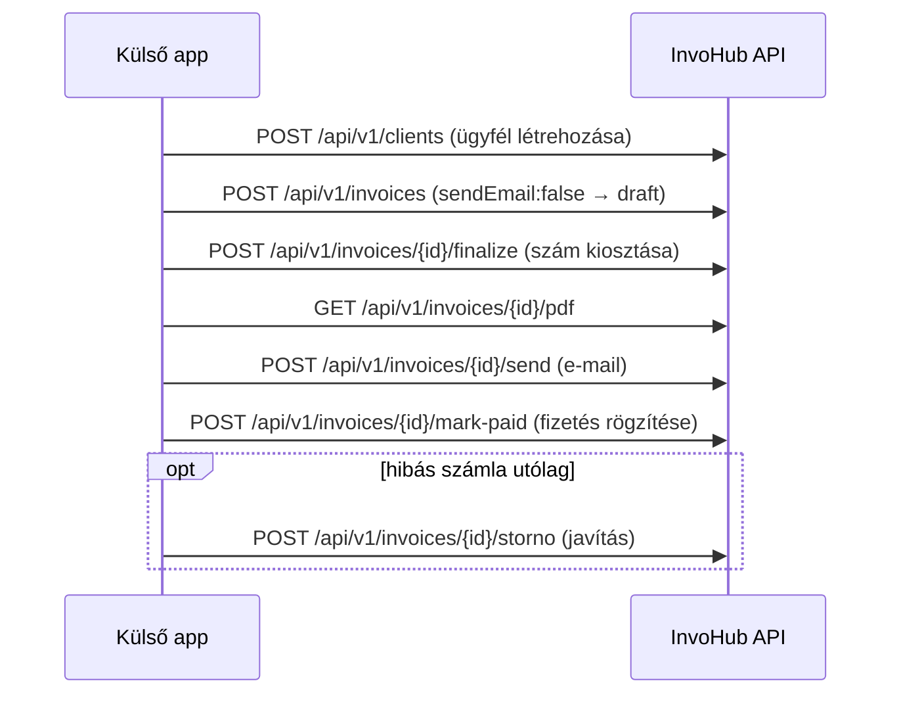

# InvoHub External API

Integrációs dokumentáció külső alkalmazásoknak (ERP, script, webhook, stb.).

**Verzió:** v1
**Auth:** API kulcs (public + secret)
**Formátum:** JSON (`Content-Type: application/json`)

---

## 1. Alap URL

| Környezet | Base URL |
|-----------|----------|
| Production | `https://invohub.vercel.app` (vagy a telepített domain) |
| Local dev | `http://localhost:8081` |

Minden végpont: `{BASE_URL}/api/v1/...`

---

## 2. Hitelesítés

### API kulcs létrehozása

1. Jelentkezz be az InvoHub-ba.
2. **Settings → API keys** menüpont.
3. Adj nevet az integrációnak, majd **Create key**.
4. Mentsd el a **secret key**-t — csak egyszer jelenik meg.

A kulcs a bejelentkezett felhasználó számláihoz kötődik (cégprofil, e-mail beállítások, NAV adatok). **Minden végpont csak a kulcshoz tartozó user adatait éri el** — egy másik user rekordjára mutató id mindig `404`-et ad, soha nem `403`-at (nincs létezés-leak).

### Kérés fejlécek

**1. Bearer token (ajánlott)**

```http
Authorization: Bearer ih_pk_<public>:ih_sk_<secret>
Content-Type: application/json
```

**2. Egyedi fejlécek**

```http
X-InvoHub-Public-Key: ih_pk_...
X-InvoHub-Secret-Key: ih_sk_...
Content-Type: application/json
```

### Hibaformátum

Minden v1 hibaválasz ugyanazt az alakot követi:

```json
{ "error": "Emberi olvasható üzenet.", "code": "someErrorCode" }
```

A `code` mező nem mindig van jelen (pl. egy egyszerű 404-nél elég az `error`), de amikor egy hiba programozottan kezelendő (pl. „ez a számla nem draft”), mindig kap egy stabil `code` értéket — lásd az egyes végpontoknál.

| HTTP | Jelentés |
|------|----------|
| `400` | Validációs hiba / hibás JSON body |
| `401` | Hiányzó vagy érvénytelen kulcs |
| `403` | Kulcs letiltva |
| `404` | Erőforrás nem található (ide tartozik: másik user rekordja) |
| `409` | Állapotütközés (pl. nem-draft számla módosítása/törlése, dupla konverzió, még futó Idempotency-Key kérés) |
| `429` | Rate limit túllépve |
| `500` / `502` | Szerver / NAV hiba |

---

## 3. Rate limit

Kulcsonként **120 kérés / perc** (fix ablak). A limit túllépésekor:

```http
HTTP/1.1 429 Too Many Requests
Retry-After: 37
```

```json
{ "error": "Rate limit exceeded. Try again later.", "code": "rateLimited" }
```

---

## 4. Idempotency-Key

Az állapot-létrehozó POST végpontokon (**számla létrehozás, véglegesítés, sztornó, helyesbítés, díjbekérő konvertálás, e-mail küldés**) opcionálisan megadható az `Idempotency-Key` fejléc:

```http
Idempotency-Key: <egyedi string, pl. UUID>
```

Szabályok:

- **Ugyanaz a kulcs + ugyanaz a végpont + ugyanaz a request body**, ugyanattól a felhasználótól, **24 órán belül** → a **korábbi válasz visszajátszása** (nem történik második számla/szám-kiosztás/e-mail/NAV hívás).
- A kulcs a **végponthoz is kötve van** (HTTP metódus + útvonal, pl. `/api/v1/invoices/<id>/finalize`): ugyanaz a kulcs egy másik végponton vagy másik számlán → `422`, soha nem egy másik kérés válasza.
- **Ugyanaz a kulcs, más request body** → `422` és `code: "idempotencyKeyConflict"`.
- **Egyidejű kérések**: ha az első, ugyanazzal a kulccsal küldött kérés még fut (pl. timeout utáni azonnali retry), a második `409` választ kap `code: "idempotencyKeyInProgress"` kóddal és `Retry-After: 1` fejléccel — a művelet csak egyszer fut le. Várj, majd küldd újra ugyanazt a kérést: a befejezett első válasz visszajátszódik.
- **Szerverhiba (5xx) vagy megszakadt feldolgozás esetén a kulcs nem tárolódik** — ugyanazzal a kulccsal biztonságosan újrapróbálható.
- A kulcs legfeljebb 255 karakter lehet (hosszabb → `400`, `code: "idempotencyKeyTooLong"`).
- 24 óra után a kulcs lejár, újrafelhasználható.
- A kulcs a **felhasználóhoz** van kötve — más felhasználó ugyanazt a kulcsot szabadon újra felhasználhatja.
- Ha nincs `Idempotency-Key` fejléc, a kérés mindig ténylegesen lefut (nincs védelem duplikált POST-ok ellen).

Ajánlott: mindig generálj egy stabil kulcsot (pl. a saját rendszered tranzakció-azonosítójából) minden retry-képes híváshoz.

---

## 5. Számla végpontok

### 5.1 Lista

`GET /api/v1/invoices`

Query paraméterek (ugyanaz a szűrés, mint a belső listánál):

| Paraméter | Leírás |
|-----------|--------|
| `status` | `draft`, `proforma`, `sent`, `paid`, `partially_paid`, `unpaid`, `overdue`, `cancelled` |
| `search` | Ügyfélnév / számlaszám / adószám részlet |
| `limit` | Oldalméret (default 30, max 100) |
| `offset` | Lapozás |

```bash
curl "https://invohub.vercel.app/api/v1/invoices?status=sent&limit=10" \
  -H "Authorization: Bearer ih_pk_YOUR_PUBLIC:ih_sk_YOUR_SECRET"
```

Válasz (`200`):

```json
{
  "invoices": [ { "...": "..." } ],
  "total": 42,
  "limit": 10,
  "offset": 0
}
```

### 5.2 Számla létrehozása

`POST /api/v1/invoices`

Draft vagy azonnal véglegesített számlát hoz létre. Alapértelmezetten **e-mailt küld PDF csatolmánnyal** (`sendEmail: true`).

> ⚠️ **Fontos, meglévő viselkedés (nem ez a változtatás vezette be, csak dokumentáljuk):** ha a body `status: "draft"` (vagy nincs `status`, ami szintén draftot jelent) és `sendEmail` nincs explicit `false`-ra állítva, a rendszer **azonnal véglegesíti** a draftot (számot oszt ki, `status` → `sent`), mielőtt elküldi az e-mailt — lásd `lib/invoices/send-invoice-email.ts`. Ha valódi, még nem számozott draftot akarsz létrehozni, mindig küldd `sendEmail: false`-t.

#### Request body

| Mező | Típus | Kötelező | Leírás |
|------|-------|----------|--------|
| `clientName` | string | igen | Ügyfél neve |
| `lineItems` | array | igen | Legalább 1 tétel |
| `lineItems[].description` | string | igen | Tétel leírás |
| `lineItems[].quantity` | number | igen | Mennyiség |
| `lineItems[].unitPrice` | number | igen | Egységár |
| `lineItems[].vatRate` | `0 \| 5 \| 18 \| 27` | nem | ÁFA % (default: `27`) |
| `lineItems[].vatCategory` | string | nem | `normal`, `AAM`, `TAM`, `KBAET`, `AHK`, `FAD`, `ATK` |
| `invoiceNumber` | string | nem | Egyedi szám; ha nincs, auto-generált véglegesítéskor |
| `documentType` | string | nem | `invoice`, `proforma`, `advance` (default: `invoice`) |
| `clientTaxNumber` | string | nem | Ügyfél adószáma |
| `issueDate` | string | nem | `YYYY-MM-DD` (default: ma) |
| `dueDate` | string | nem | `YYYY-MM-DD` (default: issueDate) |
| `status` | string | nem | `draft`, `proforma`, `sent`, `paid`, `unpaid`, `overdue`, `cancelled` (default: `draft`) |
| `currency` | string | nem | `EUR` vagy `HUF` (default: cégprofil országa szerint) |
| `exchangeRate` | number | nem | Manuális HUF árfolyam nem-HUF pénznemhez. Ha kihagyod, a rendszer automatikusan lekéri az aznapi (vagy a `issueDate`-hez legközelebbi korábbi) hivatalos MNB árfolyamot — lásd 7.1. szakasz — és ha ez sikeres, azzal menti a számlát; ha az MNB nem elérhető, a számla árfolyam nélkül marad (utólag pótolható a szerkesztő felületen). |
| `paymentMethod` | string | nem | `transfer`, `cash`, `card`, `other` |
| `notes` | string | nem | Megjegyzés a számlán |
| `sendEmail` | boolean | nem | E-mail küldés (default: `true`) — lásd a fenti figyelmeztetést |
| `emailTo` | string \| string[] | nem | Címzett(ek) felülírása |
| `emailCc` | string \| string[] | nem | Másolat (Cc) címzettek |
| `submitToNav` | boolean | nem | NAV beküldés azonnal (default: `false`) |

#### Példa — cURL (draft létrehozása, e-mail nélkül)

```bash
curl -X POST "https://invohub.vercel.app/api/v1/invoices" \
  -H "Authorization: Bearer ih_pk_YOUR_PUBLIC:ih_sk_YOUR_SECRET" \
  -H "Content-Type: application/json" \
  -H "Idempotency-Key: 6e6e6f76-invoice-2026-001" \
  -d '{
    "clientName": "Acme Kft.",
    "clientTaxNumber": "12345678-1-23",
    "lineItems": [
      { "description": "Consulting — June 2026", "quantity": 10, "unitPrice": 120, "vatRate": 27 }
    ],
    "sendEmail": false
  }'
```

#### Sikeres válasz (`201`)

```json
{
  "invoice": {
    "id": "abc123",
    "invoiceNumber": "",
    "status": "draft",
    "clientName": "Acme Kft.",
    "...": "..."
  },
  "navSubmission": null,
  "email": { "sent": false, "skipped": true }
}
```

### 5.3 Számla lekérdezése

`GET /api/v1/invoices/{id}`

```bash
curl "https://invohub.vercel.app/api/v1/invoices/abc123" \
  -H "Authorization: Bearer ih_pk_YOUR_PUBLIC:ih_sk_YOUR_SECRET"
```

Válasz (`200`): `{ "invoice": { "...": "..." } }`

### 5.4 Draft frissítése

`PATCH /api/v1/invoices/{id}`

**Csak draft állapotú** számla módosítható — a request body ugyanazokkal a szabályokkal validált, mint a létrehozásnál (5.2). Egy már véglegesített (nem-draft) számla módosítása `409`-et ad:

```json
{ "error": "Only a draft invoice can be updated.", "code": "notDraft" }
```

```bash
curl -X PATCH "https://invohub.vercel.app/api/v1/invoices/abc123" \
  -H "Authorization: Bearer ih_pk_YOUR_PUBLIC:ih_sk_YOUR_SECRET" \
  -H "Content-Type: application/json" \
  -d '{
    "clientName": "Acme Kft.",
    "lineItems": [{ "description": "Consulting", "quantity": 12, "unitPrice": 120 }]
  }'
```

### 5.5 Draft törlése

`DELETE /api/v1/invoices/{id}`

**Csak draft állapotú** számla törölhető — a folytonos számozás miatt egy véglegesített bizonylat **soha nem törölhető** (helyette: sztornó, 5.7). Nem-draft számla törlési kísérlete `409`-et ad ugyanazzal a `notDraft` kóddal, mint a PATCH-nél. Sikeres törlés: `204 No Content`.

### 5.6 Véglegesítés

`POST /api/v1/invoices/{id}/finalize`

Draftból véglegesített bizonylatot csinál — **pontosan ugyanazon a kódúton oszt ki számot**, mint az alkalmazás UI-ja (`lib/invoices/service.ts` `upsertInvoice`/`assignInvoiceNumberIfNeeded`, a composer „Véglegesítés” gombjával megegyező logika): egy díjbekérő (`documentType: "proforma"`) `status: "proforma"` lesz, minden más `status: "unpaid"`. **Nem küld e-mailt** — ehhez lásd 5.8.

Nem-draft számlán `409` + `code: "notDraft"`.

```bash
curl -X POST "https://invohub.vercel.app/api/v1/invoices/abc123/finalize" \
  -H "Authorization: Bearer ih_pk_YOUR_PUBLIC:ih_sk_YOUR_SECRET" \
  -H "Idempotency-Key: 6e6e6f76-invoice-2026-001-finalize"
```

Válasz (`200`): `{ "invoice": { "invoiceNumber": "INV-2026-00007", "status": "unpaid", "...": "..." } }`

### 5.7 Sztornó

`POST /api/v1/invoices/{id}/storno`

Sztornó (törlő) bizonylatot hoz létre, és az eredetit `cancelled` állapotba állítja. Ez a **javítás/korrekció útja** egy már véglegesített, hibás számlára — soha nem törölhető helyette (5.5). Díjbekérőre `400` + `code: "proformaNotStornoable"`; már sztornózott bizonylatra `400`.

### 5.8 Helyesbítés

`POST /api/v1/invoices/{id}/modify`

Helyesbítő (korrekciós) draftot indít, előtöltve az eredeti tételeivel — ezt a draftot a `PATCH`/`finalize` végpontokkal lehet tovább szerkeszteni és véglegesíteni. Díjbekérőre `400` + `code: "proformaNotStornoable"`.

### 5.9 Díjbekérő → számla konverzió

`POST /api/v1/invoices/{id}/convert`

„Számla készítése ebből” — egy díjbekérőt (proforma) draft számlává alakít. Nem-proforma vagy sztornózott proforma esetén `400` (`code: "notProforma"` / `code: "cancelled"`). **Ugyanaz a díjbekérő csak egyszer konvertálható**, amíg a konverzió él (nem sztornózott) — egy második konverziós kísérlet `409`-et ad, és visszaadja a már létező számlát:

```json
{ "error": "This díjbekérő was already converted.", "code": "alreadyConverted", "invoice": { "...": "..." } }
```

### 5.10 PDF

`GET /api/v1/invoices/{id}/pdf`

`Content-Type: application/pdf` — ugyanaz a generátor, mint a belső alkalmazásban (Settings → PDF appearance testreszabással).

```bash
curl "https://invohub.vercel.app/api/v1/invoices/abc123/pdf" \
  -H "Authorization: Bearer ih_pk_YOUR_PUBLIC:ih_sk_YOUR_SECRET" \
  -o invoice.pdf
```

### 5.11 E-mail küldés

`POST /api/v1/invoices/{id}/send`

Számla e-mail küldése PDF csatolmánnyal, `to`/`cc` felülírással. Ha a számla még draft, ez a hívás is véglegesíti (ugyanaz a szabály, mint az 5.2 figyelmeztetésben).

```json
{ "to": "billing@acme.hu", "cc": ["ceo@acme.hu"] }
```

Válasz (`200`): `{ "ok": true, "invoice": { "...": "..." }, "to": [...], "cc": [...], "pdfAttached": true }`

### 5.12 Fizetettnek jelölés

`POST /api/v1/invoices/{id}/mark-paid`

```json
{ "paymentMethod": "transfer", "paidAmount": 50000, "paidAt": "2026-07-10T12:00:00.000Z" }
```

`paymentMethod`, `paidAmount`, `paidAt` mind opcionális — `paidAmount` hiányában a teljes fennmaradó összeg kerül rögzítésre. Ismételt hívás **hozzáadja** a befizetést a korábbihoz (részteljesítés) — ezért ez a végpont **nem** Idempotency-Key védett, a szándékos ismétlés a funkció része.

### 5.13 NAV beküldés státusz

`GET /api/v1/invoices/{id}/nav`

Az adott számlához tartozó összes NAV beküldés (legutóbbi elöl):

```json
{ "submissions": [ { "id": "sub-1", "status": "done", "transactionId": "TX-123", "...": "..." } ] }
```

### 5.14 NAV beküldés (meglévő számla)

`POST /api/v1/invoices/{id}/nav`

Kimenő számla továbbítása a NAV felé. Előfeltétel: NAV technikai user + jelszó a cégprofilban (teszt vagy demo mód — production NAV hitelesítő adat ebben a repóban soha nincs).

Válasz (`200`): `{ "invoice": { "...": "..." }, "navSubmission": { "submissionId": "...", "status": "accepted", "transactionId": "TX-123" } }`

NAV beküldés számla létrehozáskor is kérhető: `"submitToNav": true` a create body-ban.

---

## 6. Ügyfél (client) végpontok

| Végpont | Leírás |
|---------|--------|
| `GET /api/v1/clients` | Ügyfelek listája |
| `POST /api/v1/clients` | Új ügyfél (`name` kötelező) |
| `GET /api/v1/clients/{id}` | Egy ügyfél |
| `PATCH /api/v1/clients/{id}` | Ügyfél frissítése |
| `DELETE /api/v1/clients/{id}` | Ügyfél törlése (`204`) |

```json
{ "name": "Acme Kft.", "taxNumber": "12345678-1-23", "email": "billing@acme.hu" }
```

## 7. Termék (product) végpontok

| Végpont | Leírás |
|---------|--------|
| `GET /api/v1/products` | Termékek/szolgáltatások listája |
| `POST /api/v1/products` | Új termék (`name` kötelező) |
| `GET /api/v1/products/{id}` | Egy termék |
| `PATCH /api/v1/products/{id}` | Termék frissítése |
| `DELETE /api/v1/products/{id}` | Termék törlése (`204`) |

```json
{ "name": "Tanácsadás (óra)", "unitPrice": 15000, "vatRate": 27, "currency": "HUF", "unit": "óra" }
```

---

## 7.1 Árfolyam (MNB) végpont

`GET /api/v1/exchange-rates?currency=EUR&date=2026-09-22`

A hivatalos MNB (Magyar Nemzeti Bank) HUF árfolyamot adja vissza — ugyanaz a
forrás és cache, amit a számla létrehozás/véglegesítés automatikusan használ,
amikor a body nem tartalmaz `exchangeRate`-et (lásd 5.2. szakasz). Elsősorban
akkor hasznos, ha előre meg akarod jeleníteni az árfolyamot a saját UI-odban,
mielőtt beküldenéd a számlát.

**Szabály:** a visszaadott árfolyam a megadott dátumon vagy az azt megelőző
legutóbbi MNB-publikált napon érvényes hivatalos árfolyam — az MNB
hétvégén/ünnepnapon nem publikál, ezért a válasz `rateDate` mezője eltérhet a
kért `date`-től. A `date` paraméterhez az Áfa tv. 80. § szerint a számla
teljesítés dátumát érdemes megadni, ha az ismert, egyébként a kiállítás
dátumát.

| Paraméter | Kötelező | Leírás |
|-----------|----------|--------|
| `currency` | igen | ISO 4217 kód, pl. `EUR` (a `HUF` nem érvényes — arra mindig 1 az árfolyam) |
| `date` | igen | `YYYY-MM-DD` |

```bash
curl "https://invohub.vercel.app/api/v1/exchange-rates?currency=EUR&date=2026-09-22" \
  -H "Authorization: Bearer ih_pk_YOUR_PUBLIC:ih_sk_YOUR_SECRET"
```

Sikeres válasz (`200`):

```json
{ "currency": "EUR", "rate": 397.5, "rateDate": "2026-09-22", "source": "MNB" }
```

Hibák: `404` — az MNB-nek nincs adata a kért pénznemhez/dátumhoz a lekérdezési
ablakban; `502` — az MNB szolgáltatása nem volt elérhető.

---

## 8. Teljes integrációs flow — díjbekérő nélkül



1. **Ügyfél létrehozása** (opcionális, ha még nincs): `POST /api/v1/clients`.
2. **Draft számla létrehozása**: `POST /api/v1/invoices` `sendEmail: false`-szal, hogy ne véglegesüljön/menjen ki azonnal.
3. **Véglegesítés**: `POST /api/v1/invoices/{id}/finalize` — ekkortól van végleges `invoiceNumber`.
4. **PDF letöltés/megtekintés** (opcionális): `GET /api/v1/invoices/{id}/pdf`.
5. **Küldés e-mailben**: `POST /api/v1/invoices/{id}/send`.
6. **Fizetés rögzítése**: `POST /api/v1/invoices/{id}/mark-paid`, amint megérkezik az összeg.
7. **Javítás, ha szükséges**: a véglegesített számla soha nem szerkeszthető/törölhető közvetlenül — `POST /api/v1/invoices/{id}/storno` érvényteleníti, utána egy új draft/számla készül helyette (esetleg `modify` a helyesbítő draft-hoz).

Minden retry-képes lépésnél (2, 3, 6, 7) érdemes `Idempotency-Key`-t küldeni (lásd 4. szakasz), hogy egy hálózati timeout miatti retry ne dupláz­za a számot/e-mailt/fizetést.

---

## 9. Biztonság

- A **secret key** titkos — ne commitold, ne logold, ne küldd query stringben.
- Csak **HTTPS** production környezetben.
- Kulcs kompromittálás esetén: Settings → API keys → **Revoke**, új kulcs.
- Minden végpont a kulcshoz tartozó userre szűr — másik user rekordja mindig `404`.

---

## 10. OpenAPI / további végpontok

A fenti a teljes **v1 külső API** — számla teljes életciklus (létrehozás → véglegesítés → PDF → küldés → fizetés/sztornó), ügyfelek és termékek. A belső (session cookie-s) API-k — pl. `/api/invoices`, `/api/clients` — **nem** részei a külső integrációnak, azok csak a webalkalmazás saját UI-ját szolgálják ki.

Kérdés / hiba: hello@codence.hu
