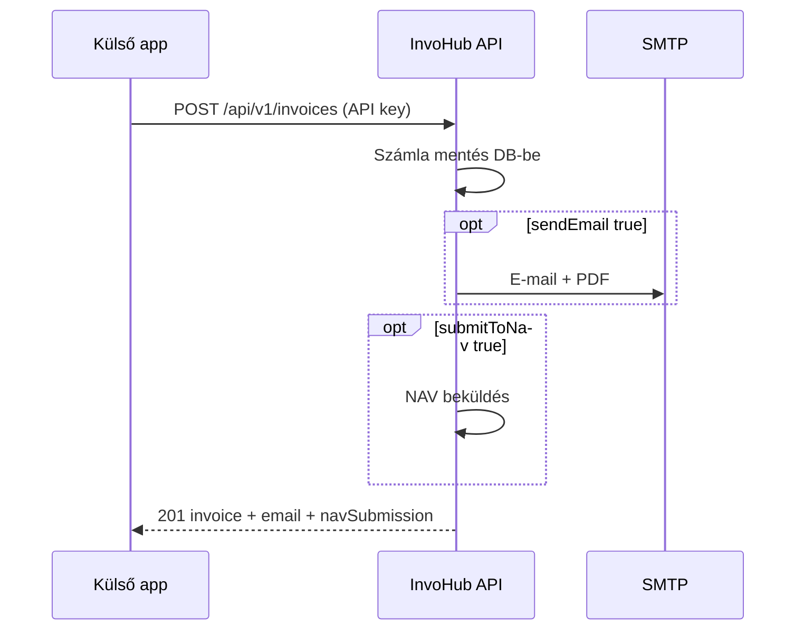

# InvoHub External API

Integrációs dokumentáció külső alkalmazásoknak (ERP, script, webhook, stb.).

**Verzió:** v1  
**Auth:** API kulcs (public + secret)  
**Formátum:** JSON (`Content-Type: application/json`)

---

## 1. Alap URL

| Környezet | Base URL |
|-----------|----------|
| Production | `https://invohub.vercel.app` (vagy a telepített domain) |
| Local dev | `http://localhost:8081` |

Minden végpont: `{BASE_URL}/api/v1/...`

---

## 2. Hitelesítés

### API kulcs létrehozása

1. Jelentkezz be az InvoHub-ba.
2. **Settings → API keys** menüpont.
3. Adj nevet az integrációnak, majd **Create key**.
4. Mentsd el a **secret key**-t — csak egyszer jelenik meg.

A kulcs a bejelentkezett felhasználó számláihoz kötődik (cégprofil, e-mail beállítások, NAV adatok).

### Kérés fejlécek

**1. Bearer token (ajánlott)**

```http
Authorization: Bearer ih_pk_<public>:ih_sk_<secret>
Content-Type: application/json
```

**2. Egyedi fejlécek**

```http
X-InvoHub-Public-Key: ih_pk_...
X-InvoHub-Secret-Key: ih_sk_...
Content-Type: application/json
```

### Hibák

| HTTP | Jelentés |
|------|----------|
| `401` | Hiányzó vagy érvénytelen kulcs |
| `403` | Kulcs letiltva |
| `404` | Erőforrás nem található (más user számlája) |
| `400` | Validációs hiba |
| `500` | Szerver / NAV hiba |

---

## 3. Végpontok

### 3.1 Számla létrehozása

`POST /api/v1/invoices`

Létrehoz egy számlát. Alapértelmezetten **e-mailt küld PDF csatolmánnyal** (`sendEmail: true`).

#### Request body

| Mező | Típus | Kötelező | Leírás |
|------|-------|----------|--------|
| `clientName` | string | igen | Ügyfél neve |
| `lineItems` | array | igen | Legalább 1 tétel |
| `lineItems[].description` | string | igen | Tétel leírás |
| `lineItems[].quantity` | number | igen | Mennyiség |
| `lineItems[].unitPrice` | number | igen | Egységár |
| `lineItems[].vatRate` | `0 \| 5 \| 27` | nem | ÁFA % (default: `27`) |
| `invoiceNumber` | string | nem | Egyedi szám; ha nincs, auto-generált |
| `clientTaxNumber` | string | nem | Ügyfél adószáma |
| `issueDate` | string | nem | `YYYY-MM-DD` (default: ma) |
| `dueDate` | string | nem | `YYYY-MM-DD` (default: issueDate) |
| `status` | string | nem | `draft`, `proforma`, `sent`, `paid`, `overdue`, `cancelled` (default: `draft`) |
| `currency` | string | nem | `EUR` vagy `HUF` (default: `EUR`) |
| `notes` | string | nem | Megjegyzés a számlán |
| `sendEmail` | boolean | nem | E-mail küldés (default: `true`) |
| `emailTo` | string \| string[] | nem | Címzett(ek) felülírása — egy e-mail, vesszővel elválasztott lista, vagy tömb |
| `emailCc` | string \| string[] | nem | Másolat (Cc) címzettek — felülírja a cégprofil Cc mezőjét |
| `submitToNav` | boolean | nem | NAV beküldés azonnal (default: `false`) |

#### E-mail címzett feloldása

Ha `emailTo` nincs megadva, sorrend:

1. Cégprofil → **Invoice email (To)** mező
2. Ügyfél e-mail (név alapján keresve)
3. Ha egyik sincs → `email.sent: false`, hibaüzenet a válaszban

Ha `emailTo` meg van adva, az API **közvetlenül** ezeknek küldi (több címzett is megadható).

Cc sorrend:

1. `emailCc` a request body-ban (ha megadva — akár üres tömb is, ekkor nincs Cc)
2. Egyébként cégprofil **Invoice email (Cc)** mező

#### Példa — cURL

```bash
curl -X POST "https://invohub.vercel.app/api/v1/invoices" \
  -H "Authorization: Bearer ih_pk_YOUR_PUBLIC:ih_sk_YOUR_SECRET" \
  -H "Content-Type: application/json" \
  -d '{
    "clientName": "Acme Kft.",
    "clientTaxNumber": "12345678-1-23",
    "status": "sent",
    "currency": "EUR",
    "lineItems": [
      {
        "description": "Consulting — June 2026",
        "quantity": 10,
        "unitPrice": 120,
        "vatRate": 27
      }
    ],
    "sendEmail": true,
    "emailTo": ["billing@acme.hu", "accounting@acme.hu"],
    "emailCc": "ceo@acme.hu"
  }'
```

#### Példa — Node.js (fetch)

```javascript
const BASE = process.env.INVOHUB_BASE_URL;
const AUTH = `Bearer ${process.env.INVOHUB_PUBLIC_KEY}:${process.env.INVOHUB_SECRET_KEY}`;

const response = await fetch(`${BASE}/api/v1/invoices`, {
  method: "POST",
  headers: {
    Authorization: AUTH,
    "Content-Type": "application/json",
  },
  body: JSON.stringify({
    clientName: "Acme Kft.",
    status: "sent",
    currency: "HUF",
    lineItems: [{ description: "Service fee", quantity: 1, unitPrice: 50000, vatRate: 27 }],
    sendEmail: true,
  }),
});

const data = await response.json();
if (!response.ok) throw new Error(data.error ?? response.statusText);
console.log(data.invoice.invoiceNumber, data.email);
```

#### Sikeres válasz (`201`)

```json
{
  "invoice": {
    "id": "abc123",
    "invoiceNumber": "INV-2026-005",
    "clientName": "Acme Kft.",
    "issueDate": "2026-07-04",
    "dueDate": "2026-07-18",
    "status": "sent",
    "currency": "EUR",
    "lineItems": [
      {
        "id": "line1",
        "description": "Consulting — June 2026",
        "quantity": 10,
        "unitPrice": 120,
        "vatRate": 27
      }
    ],
    "createdAt": "2026-07-04T10:00:00.000Z",
    "updatedAt": "2026-07-04T10:00:00.000Z"
  },
  "navSubmission": null,
  "email": {
    "sent": true,
    "to": ["billing@acme.hu", "accounting@acme.hu"],
    "cc": ["ceo@acme.hu"],
    "pdfAttached": true
  }
}
```

E-mail kikapcsolása: `"sendEmail": false`

---

### 3.2 Számla lekérdezése

`GET /api/v1/invoices/{id}`

Csak a kulcshoz tartozó user számlái érhetők el.

#### Példa

```bash
curl "https://invohub.vercel.app/api/v1/invoices/abc123" \
  -H "Authorization: Bearer ih_pk_YOUR_PUBLIC:ih_sk_YOUR_SECRET"
```

#### Válasz (`200`)

```json
{
  "invoice": { "...": "..." }
}
```

---

### 3.3 NAV beküldés (meglévő számla)

`POST /api/v1/invoices/{id}/nav`

Kimenő számla továbbítása a NAV felé. Előfeltétel: NAV technikai user + jelszó a cégprofilban.

#### Példa

```bash
curl -X POST "https://invohub.vercel.app/api/v1/invoices/abc123/nav" \
  -H "Authorization: Bearer ih_pk_YOUR_PUBLIC:ih_sk_YOUR_SECRET"
```

#### Válasz (`200`)

```json
{
  "invoice": { "...": "..." },
  "navSubmission": {
    "submissionId": "nav-sub-1",
    "status": "accepted",
    "transactionId": "TX-123"
  }
}
```

NAV beküldés számla létrehozáskor: `"submitToNav": true` a create body-ban.

---

## 4. PDF

- A **külső API nem ad közvetlen PDF letöltést**.
- PDF csatolmány az **e-mail küldés** része (`sendEmail: true`).
- PDF kinézet: **Settings → PDF appearance** (cím, színek, lábléc).

---

## 5. Ajánlott integrációs flow



1. Hozz létre API kulcsot InvoHub Settings-ben.
2. Állítsd be a cégprofilt (számlázó adatok, invoice e-mail, NAV technikai user + **teszt vagy élő környezet**).
3. Hívd a `POST /api/v1/invoices` végpontot.
4. Ellenőrizd a válasz `email.sent` és `navSubmission.status` mezőit.

---

## 6. Biztonság

- A **secret key** titkos — ne commitold, ne logold, ne küldd query stringben.
- Csak **HTTPS** production környezetben.
- Kulcs kompromittálás esetén: Settings → API keys → **Revoke**, új kulcs.

---

## 7. OpenAPI / további végpontok

Jelenleg a **v1 külső API** csak a fenti 3 végpontot tartalmazza.  
A belső (session cookie-s) API-k — pl. `/api/invoices`, `/api/clients` — **nem** részei a külső integrációnak.

Kérdés / hiba: hello@codence.hu
